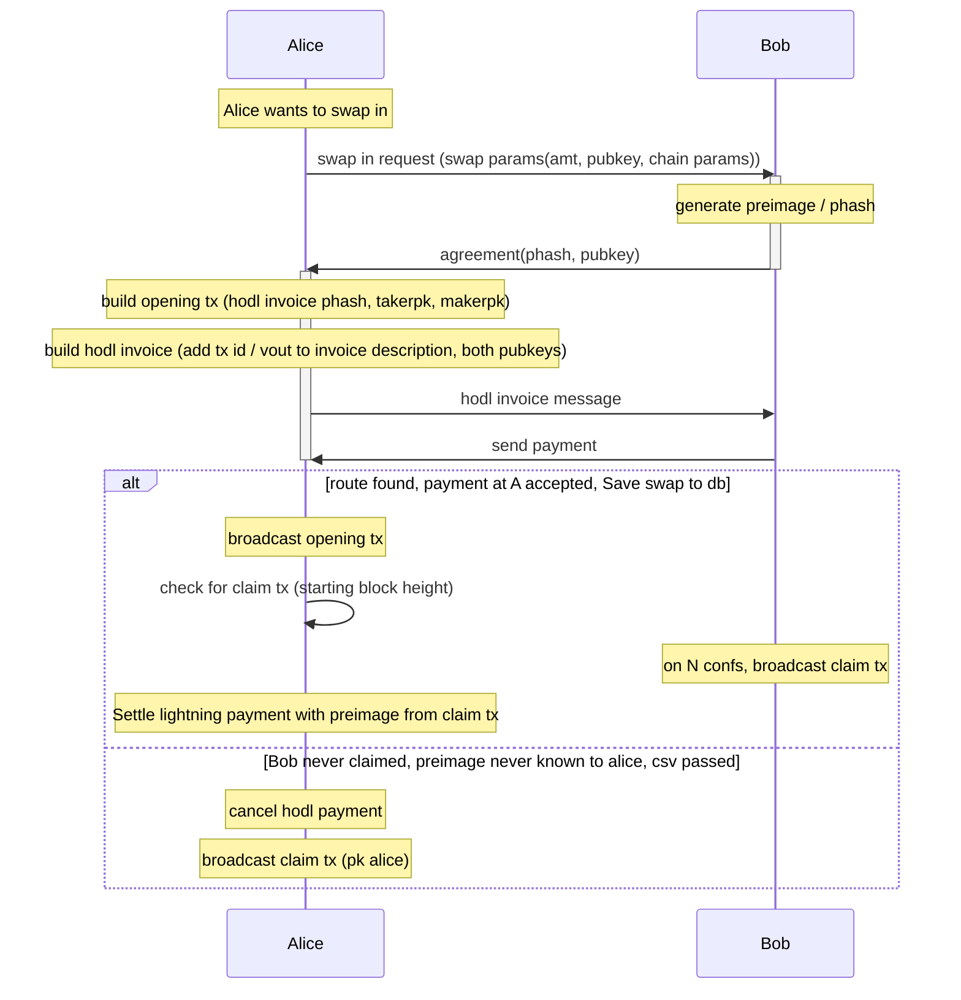
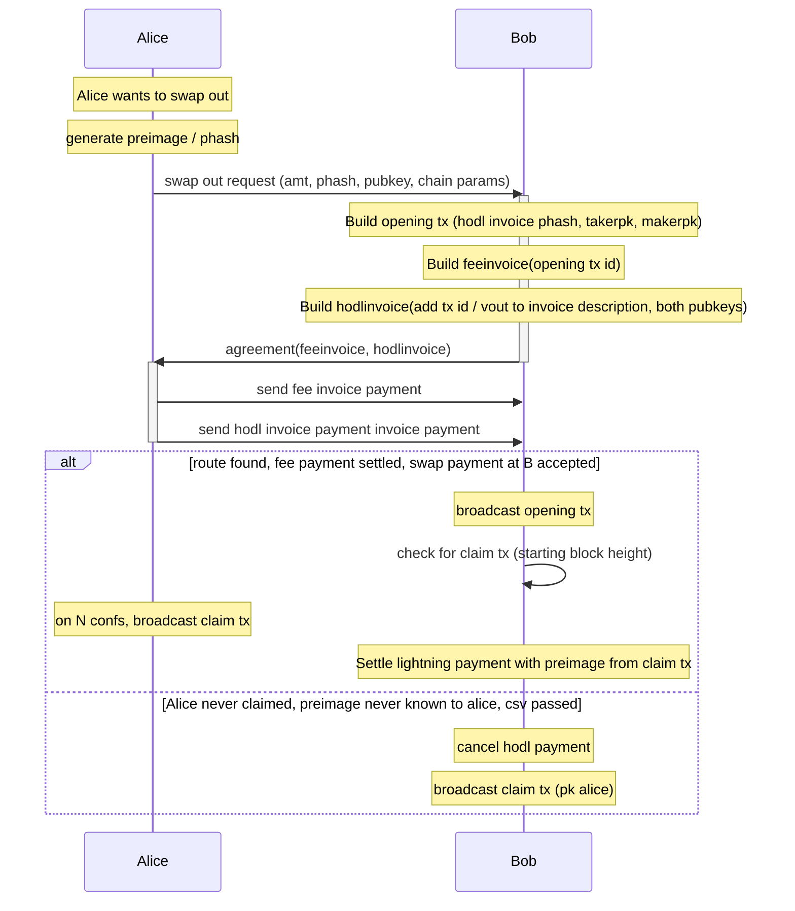

# Swap In

```mermaid
sequenceDiagram
participant A as Alice
participant B as Bob

Note over A: Alice wants to swap in

A->>B: swap in request (swap params(amt, pubkey, chain params))
activate B
Note over B: generate preimage / phash
B->>A: agreement(phash, pubkey) 
deactivate B
activate A
Note over A: build opening tx (hodl invoice phash, takerpk, makerpk)
Note over A: build hodl invoice (add tx id / vout to invoice description, both pubkeys)
A->>B: hodl invoice message
B->>A: send payment
deactivate A
alt route found, payment at A accepted, Save swap to db
Note over A: broadcast opening tx
A->>A: check for claim tx (starting block height)
Note over B: on N confs, broadcast claim tx
Note over A: Settle lightning payment with preimage from claim tx
else Bob never claimed, preimage never known to alice, csv passed
Note over A: cancel hodl payment
Note over A: broadcast claim tx (pk alice)
end
```

# Swap Out

```mermaid
sequenceDiagram
participant A as Alice
participant B as Bob

Note over A: Alice wants to swap out
Note over A: generate preimage / phash
A->>B: swap out request (amt, phash, pubkey, chain params)
activate B
Note over B: Build opening tx (hodl invoice phash, takerpk, makerpk)
Note over B: Build feeinvoice(opening tx id)
Note over B: Build hodlinvoice(add tx id / vout to invoice description, both pubkeys)
B->>A: agreement(feeinvoice, hodlinvoice) 
deactivate B
activate A
A->>B: send fee invoice payment
A->>B: send hodl invoice payment invoice payment
deactivate A
alt route found, fee payment settled, swap payment at B accepted
Note over B: broadcast opening tx
B->>B: check for claim tx (starting block height)
Note over A: on N confs, broadcast claim tx
Note over B: Settle lightning payment with preimage from claim tx
else Alice never claimed, preimage never known to alice, csv passed
Note over B: cancel hodl payment
Note over B: broadcast claim tx (pk alice)
end
```
