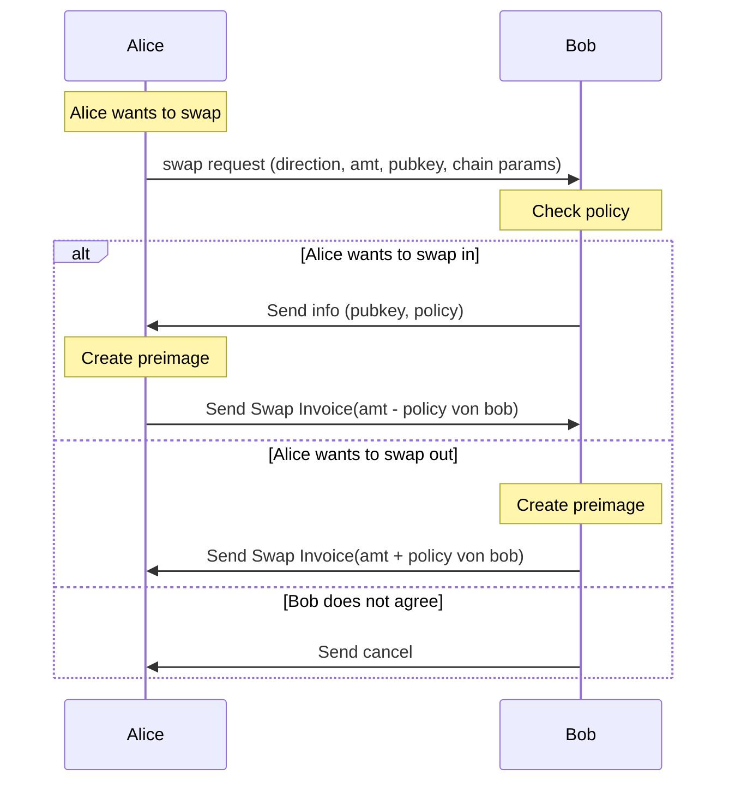
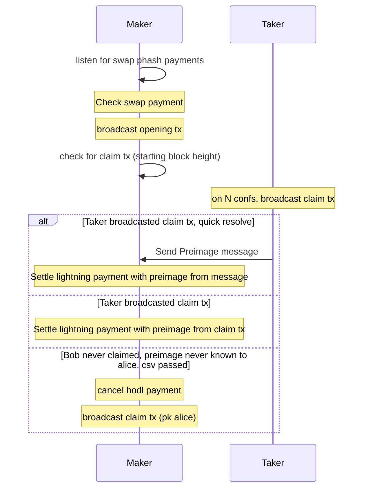

# Negotiation

Beide State:

Swap Invoice (swap amount, pubkeyA, pubkeyB, swap phash)

Peer Lightning pubkey

Taker:
Swap Preimage

Swap listener
- Phashs von contracts listenen und dann opening tx broadcast
# Swap
